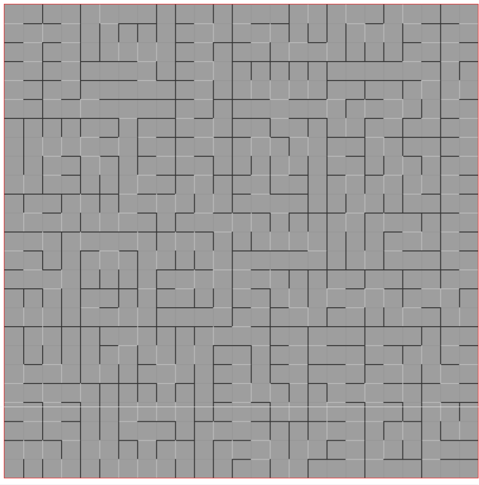

## Description

This is maze generator using Recursive division method ([wiki](https://en.wikipedia.org/wiki/Maze_generation_algorithm))

To generate maze you can enter one size (default size: 50) and click `generate` button to start.
After generate maze you can also find solution (examples times below).

There is no need to run any server, just download `dist` content and open `index.html`
## Commands

`npm start` - start webpack dev server  
`npm run build` - build project to `dist`directory

## Examples

- 25x25 cells - with animation: 2s 50ms, instant: 56ms

- 50x50 cells - with animation: 9s 91ms, instant: 100ms

- 100x100 cells - with animation: 57s 395ms, instant: 205ms

## Walkthrough timing

- 25x25 cells - with animation: 10s 822ms, instant: 9ms

- 50x50 cells - with animation: 40s 454ms, instant: 13ms

- 100x100 cells - with animation: 2min 38s 7ms,instant: 24ms
