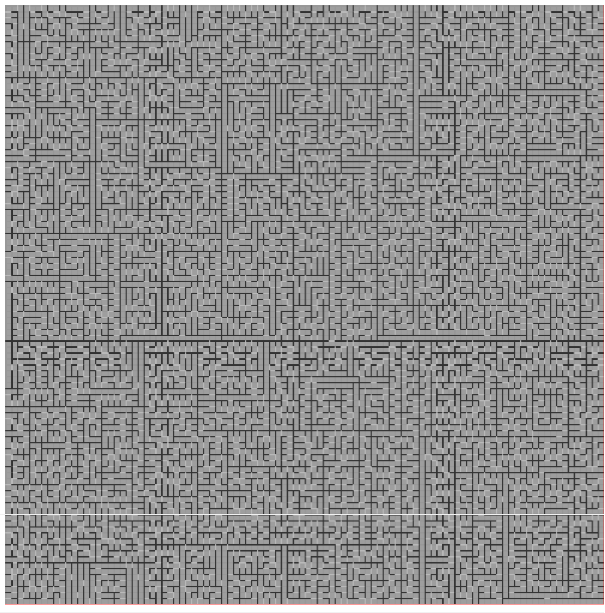

## Description

This is maze generator using Recursive division method ([wiki](https://en.wikipedia.org/wiki/Maze_generation_algorithm))

To generate maze you can enter one size (default size: 50) and click `generate` button to start.
You can change size any time but any progress will be lost.

There is no need to run any server, just download `dist` content and open `index.html`
## Commands

`npm start` - start webpack dev server  
`npm run build` - build project to `dist`directory

## Examples

- 25x25 cells - 0:07:673 min

- 50x50 cells - 0:57:118 min

- 100x100 cells - 12:31:686 min

