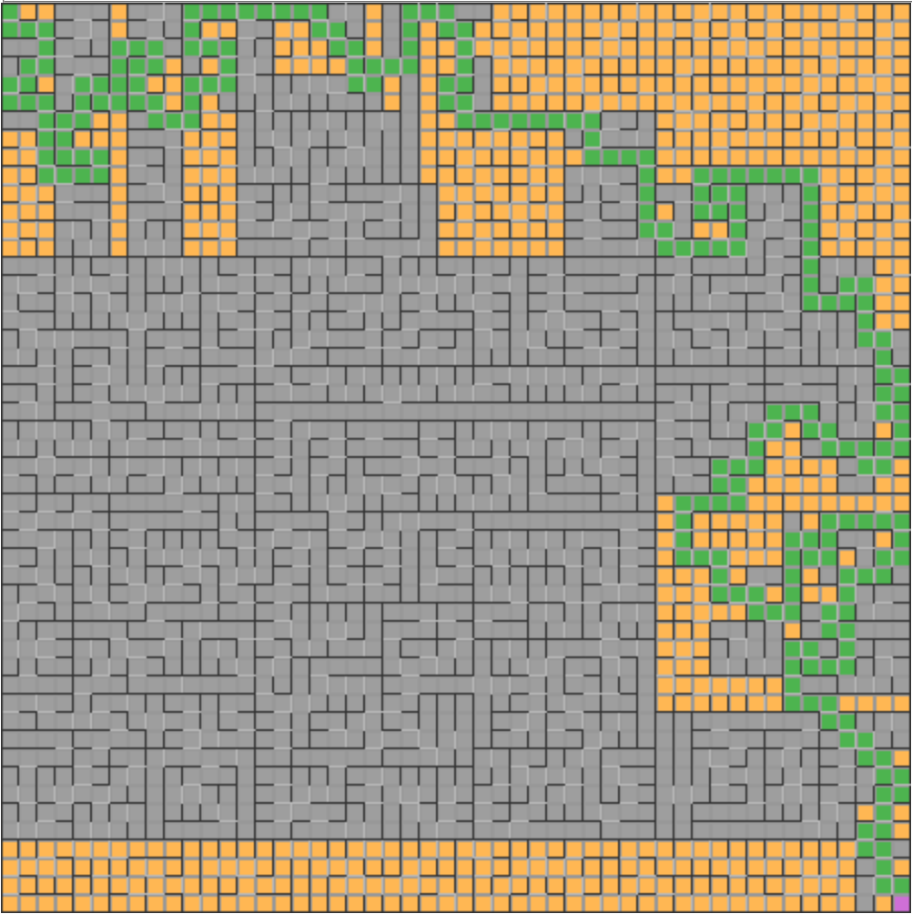

## Description

This is maze generator using Recursive division method ([wiki](https://en.wikipedia.org/wiki/Maze_generation_algorithm))

To generate maze you can enter one size (default size: 50) and click `generate` button to start.
After generate maze you can also find solution (examples times below).

There is no need to run any server, just download `dist` content and open `index.html`
## Commands

`npm start` - start webpack dev server  
`npm run build` - build project to `dist`directory

## Examples

- 25x25 cells - with animation: 7s 673ms, instant: 41ms ()

- 50x50 cells - with animation: 57s 118ms, instant: 121ms

- 100x100 cells - with animation: 12min 31s 686ms, instant: 288ms

## Walkthrough timing

- 25x25 cells - with animation: 4s 530ms, instant: 10ms

- 50x50 cells - with animation: 1min 49s 7ms, instant: 7ms

- 100x100 cells - with animation: 1h 5min 29s 88ms,instant: 21ms
